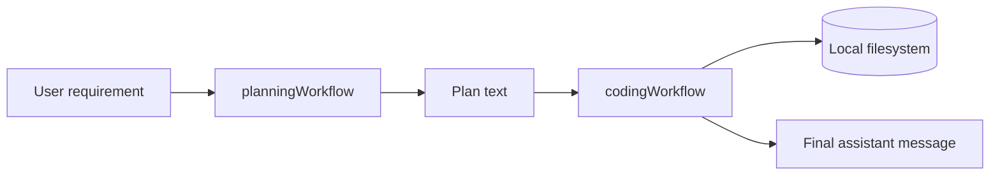
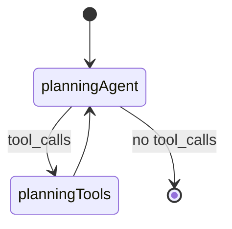

# Building an Autonomous Plan-and-Execute Coding Agent with LangGraph

Most “coding assistants” stop at chat: they return snippets you paste yourself. **`codinagent.py`** goes further. It is a small but complete pipeline that (1) turns a natural-language product request into a structured implementation plan, then (2) runs a second agent that **actually writes to disk**—directories, files, and full source—until the model stops calling tools. The orchestration lives in roughly 290 lines of Python, built on **LangGraph**, **LangChain tools**, and **OpenAI** via `ChatOpenAI`.

This post walks through that design in depth: state, tools, two identical graph topologies with different roles, and how the handoff from planner to coder works.

---

## The problem: chat is not delivery

A model that only replies with markdown code blocks has not shipped software. Real delivery needs:

- A **plan** (structure, files, responsibilities, steps).
- **Side effects** on the filesystem (create paths, read before overwrite, write bytes).
- A **loop** that continues until the job is done or the model is finished tool-calling.

`codinagent.py` separates **planning** from **implementation** on purpose. One graph is constrained to think and document; the other is constrained to use filesystem tools. That split reduces the classic failure mode where a single agent “implements” by dumping code in the chat window.

---

## High-level architecture

At runtime the script runs **two compiled workflows** in sequence:



Each workflow is a **ReAct-style** graph: an LLM node alternates with a **ToolNode** until the last assistant message has no `tool_calls`.



The coding graph mirrors this with `codingAgent` / `codingTools`.

There is **no** single LangGraph that chains planner → coder internally. The **Python driver** extracts the plan string and starts a **fresh** coding conversation with that plan embedded. That is a deliberate, simple integration point—and also a place you could later replace with one parent graph or shared checkpointing.

---

## Shared foundation: state, model, and environment

### State as an append-only message list

LangGraph state is a `TypedDict` with one field:

```python
class State(TypedDict):
    messages: Annotated[list, operator.add]
```

`Annotated[list, operator.add]` means each node returns **partial updates** like `{"messages": [new_message]}` and LangGraph **concatenates** them into the thread. That matches how chat histories grow across tool rounds: user → assistant (tool calls) → tool results → assistant → …

Both graphs reuse the same `State` type. Only the **system prompts** and **which workflow** you invoke differ.

### Model and configuration

```python
llm = ChatOpenAI(model="gpt-5.4-mini")
```

Credentials and keys come from the environment via `load_dotenv()` at import time—the same pattern as `graph.py` in this repo’s customer-support demo.

---

## The filesystem layer: plain functions, then tools

The agent’s “hands” are five operations:

| Operation | Purpose |
|-----------|---------|
| `CreateDirectory` | `os.makedirs(..., exist_ok=True)` |
| `CreateFile` | Ensures parent dir, creates empty file |
| `ReadFile` | UTF-8 read |
| `WriteFile` | Ensures parent dir, overwrites content |
| `GetCurrentDirectory` | `os.getcwd()` for anchoring relative paths |

Implementation details worth noting:

- **Directories are created lazily** in both `CreateFile` and `WriteFile`, so the model does not have to call `CreateDirectory` first every time.
- **`WriteFile` is the workhorse** for real implementation; `CreateFile` only touches an empty file.
- Tools are thin `@tool` wrappers so the LLM gets JSON-schema arguments and docstrings for routing.

```python
all_tools = [
    CreateDirectoryTool,
    CreateFileTool,
    ReadFileTool,
    WriteFileTool,
    GetCurrentDirectoryTool,
]
```

**Security implication:** these tools run with the **same privileges as the Python process**. Whatever directory you run the script from is the sandbox boundary unless you add path allowlists, chroots, or a dedicated workspace root. The sample hard-coded query builds a Markdown editor under that cwd—in this project, artifacts like `index.html`, `css/styles.css`, and `js/app.js` under `server/` are evidence of a successful run.

---

## Phase 1: the planning agent

### Same tools, different contract

The planner binds the **same** `all_tools` as the coder:

```python
planningLLM = llm.bind_tools(all_tools)
```

Binding tools does not force their use; the **system prompt** defines behavior. The planner is told to cover structure, folders, files, tech choices, file contents *at a spec level*, and implementation steps—and explicitly **not** to implement or write code into files.

That instruction set is how you get a **durable artifact** (`plan`) suitable for the second phase: prose and structure, not a single blob of code in chat.

### The planning node

`PlanningAgent` prepends the system message and forwards `state["messages"]`. The system prompt includes:

- Project structure, folders, files, technologies
- What each file should contain and implementation steps
- Explicit rules: **only** create the plan; do **not** implement or write code into files

If the planner still calls tools (e.g. `GetCurrentDirectoryTool` to see where it is), the graph supports that without changing topology.

### Conditional routing: the ReAct loop

```python
def ShouldPlanningContinue(state: State):
    last_message = state["messages"][-1]
    if last_message.tool_calls:
        return "tools"
    return "end"
```

LangGraph’s prebuilt `ToolNode(all_tools)` executes tool calls from the last AI message, appends tool messages, and returns control to `planningAgent`. This is the same **agent ↔ tools** pattern documented for LangGraph tool agents.

Graph wiring:

- `START` → `planningAgent`
- Conditional: `planningAgent` → `planningTools` or `END`
- `planningTools` → `planningAgent`

When the planner finishes with a normal assistant message (no pending tools), the workflow hits `END`. The driver then reads:

```python
plan = planningResult["messages"][-1].content
```

So the **contract** between phases is: *the last planner message body is the plan*. If you ever add more user turns inside the planning graph, you would want to select the last **assistant** message without tool calls, not blindly `[-1]`.

---

## Phase 2: the coding agent

### Inverted constraints

The coding agent uses the same graph shape but the system prompt demands **filesystem side effects**:

- Understand the plan, check cwd, create dirs/files, write code
- **Do not** only explain code or return code in chat
- **Must** use filesystem tools
- If a file exists, **read** before modifying

Those lines fight **LLM default behavior** (explain in chat). Forcing tool use is what turns the second phase into a **coding executor** rather than a tutor.

`ShouldCodingContinue` and the coding graph edges are structurally identical to planning—only node names change (`codingAgent`, `codingTools`). That duplication is clear and easy to teach; production code might extract a factory `build_tool_loop(name, system_prompt)`.

---

## Orchestration: how plan meets code

The bottom of the file is the **meta-controller**—not inside LangGraph, but plain Python:

1. Define `user_query` (example: HTML/CSS/JS Markdown editor with live preview, toolbar, and localStorage).
2. `planningWorkflow.invoke({"messages": [{"role": "user", "content": user_query}]})`.
3. Print and capture `plan`.
4. `codingWorkflow.invoke` with a **new** user message that includes both the original request and the full plan text.
5. Print the coding agent’s final natural-language summary.

**Why two separate invokes?**

- **Context hygiene:** the coder is not polluted with the planner’s tool traces unless you choose to pass them.
- **Role clarity:** each graph sees one primary user task plus a fixed system role.
- **Simplicity:** no supervisor node, no `Command(goto=...)`, no checkpointer—unlike `graph.py` in the same repo, which routes between order/payment specialists and supports human-in-the-loop interrupts.

**Tradeoff:** the plan is passed as **unstructured text**. There is no JSON schema validation, no automated diff against a file manifest, and no verification step (tests, lint, “does `index.html` exist?”). Extending the pipeline with a third “verifier” graph or structured plan (`TypedDict` / Pydantic) would be a natural next step.

---

## What “autonomous” means here

Colloquially people say the agent “codes itself.” In this codebase the precise meaning is:

| Claim | Accurate? |
|--------|-----------|
| Plans its own implementation steps | Yes (planning graph + prompt) |
| Executes without you pasting files | Yes (tool loop until done) |
| Modifies its own `codinagent.py` | Only if you ask for that in `user_query`; nothing special-cases self-modification |
| Runs forever / self-improves | No; single shot per script run |

So it is an **autonomous plan-and-execute coding agent** for **greenfield (or overwrite) filesystem work**, not a self-evolving repository bot unless you design that on top.

---

## End-to-end example: Markdown editor

The bundled `user_query` in `codinagent.py` asks for a full static Markdown studio—not a toy textarea, but a product-shaped UI:

- Split **editor** and **live preview** panes
- **marked.js** (CDN) for rendering headings, bold, italic, links, images, lists, code blocks, and blockquotes
- **Toolbar** shortcuts (H1, H2, bold, italic, link, image, lists, code, quote)
- **Word and character counts**, copy-to-clipboard, download as `.md`, and clear editor
- **localStorage** autosave with restore on reload
- Responsive, clean layout with an appropriate folder structure

After a successful run, the coding agent writes real files under your working directory—typically `index.html`, `css/styles.css`, `js/app.js`, and a `README.md` that documents the feature set. No copy-paste from chat; the app is on disk and ready to open in a browser.

Below is the Markdown editor **built entirely by the agent** (plan phase + tool-driven implementation), running in the browser:


The screenshot shows what the pipeline is optimizing for: structured layout (header, toolbar, dual panels, footer actions), rendered Markdown in the preview pane (including styled blockquotes), and polish like the “Saved locally” status pill—details that are easy to skip when a model only answers in prose.

That closes the loop: **requirement → plan → files on disk → open `index.html` and use the app.**

---

## Design lessons

1. **Separate graphs for separate incentives.** Planning and coding share tools but diverge sharply in system prompts—cheaper than training two models and clearer than one prompt that tries to do everything.

2. **LangGraph’s value is the loop, not the LLM call.** One `invoke` on the LLM would not retry tools; the graph encodes **continue until no tool_calls**.

3. **ToolNode is the integration point.** You keep business logic in plain Python (`WriteFile`, etc.) and let LangGraph handle tool execution and message formatting.

4. **The handoff is a product decision.** String plans are easy to debug (`print(plan)`) but weak for machine verification. Structured plans + a file checklist node would harden the system.

5. **Contrast with multi-agent routing in the same repo.** `graph.py` uses a **supervisor** (`Command(goto="orders")`), specialist subgraphs, and `interrupt()` for refunds. `codinagent.py` is a **linear pipeline** of two tool loops—better fit for codegen than for conversational support.

---

## Minimal mental model

Think of `codinagent.py` as three layers:

1. **Capabilities** — filesystem functions exposed as LangChain tools.
2. **Control** — two LangGraph ReAct loops (plan, then code).
3. **Orchestration** — Python glue that passes the plan text and prints outcomes.

That is enough to go from “LLM that talks about code” to “LLM that **writes** a Markdown editor on your machine”—with a clear path to harder engineering (structured plans, verification, sandboxed cwd, and a single parent graph) when you outgrow the script.

---

## How to run it

From the `server` directory, with `OPENAI_API_KEY` (or compatible env) set and dependencies installed:

```bash
python codinagent.py
```

Watch the printed plan, then the coding agent summary, then inspect new or updated files under your current working directory.
